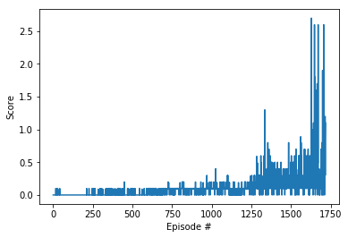
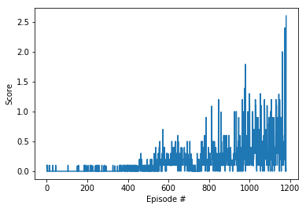

# Collaboration and Competition Report

### Algorithm

The solution for this project closely follows the original MADDPG algorithm laid out in the [original Multi-Agent DDPG paper](https://arxiv.org/pdf/1706.02275.pdf).

Each sub-agent in the environment was trained with its own set of actor and critic networks. The actor network only took in the local state information for each sub-agent, while each critic considered the

The algorithm uses an 'actor' to determine the best action and a 'critic' to estimate the value-function for that action. These were trained using an Adam optimization function.

For both the actor and critic, the algorithm makes use of 2 networks, one online and one target. The target network is used while training to provide stability. The target is updated using a soft update strategy parameterized by tau.

While interacting with the environment, Ornstein-Uhlenbeck noise is added to the action space. Experience tuples are stored in an experience replay buffer, and both a random batch and prioritized batch sampling were used to train the actor and critic networks.

#### Network Setup

The actor network used three linear nodes:
- input node: fully connected node with 24 inputs and 256 outputs
- hidden node: fully connected node with 256 inputs and 128 outputs
- output node: fully connected node with 128 inputs and 2 outputs

The critic network took in 52 inputs which corresponds to the input spaces and the number of actions times the number of agents.

`2 * 24 + 2 * 2`

These inputs were fed into a fully connected node with 256 outputs. This was fed into a hidden node with 128 outputs. The final node was another fully connected layer of 128 inputs and 1 output.

The input and hidden nodes used a ReLU activation function and the output node on the actor used a tanh activation function and the critic used a linear activation function.

#### Hyperparameters

The hyperparameters used by the agent were the following:
- Batch size: 512
- Actor Learning Rate: 0.0001
- Critic Learning Rate: 0.0003
- Tau: 0.2
- Gamma: 0.99
- Replay Buffer Size: 1e5

To train the agent, a max timestep of 2000 was used per episode.

The algorithm makes use of Ornstein-Uhlenbeck noise with the following settings:
- mu: 0
- theta: 0.15
- sigma: 0.2

### Results

#### Random Access Memory

The first attempt was made at using a standard experience replay buffer with random access memory. When run with the hyperparameters listed above, the agent achieved an score of 0.5+ max averaged over the last 100 episodes in **1717** episodes.

The scores oscillated between 0 and 0.1 for the first 1000 episodes or so. There was a spike of high scores at the end around episode 1500 where the agents learned the winning strategy. This led to a rapid increase in average scores.

The agent took 18.7 minutes to train.


```
Episode 100	Average Score: 0.00
Episode 200	Average Score: 0.00
Episode 300	Average Score: 0.01
Episode 400	Average Score: 0.04
Episode 500	Average Score: 0.02
Episode 600	Average Score: 0.01
Episode 700	Average Score: 0.06
Episode 800	Average Score: 0.08
Episode 900	Average Score: 0.09
Episode 1000	Average Score: 0.09
Episode 1100	Average Score: 0.11
Episode 1200	Average Score: 0.07
Episode 1300	Average Score: 0.13
Episode 1400	Average Score: 0.22
Episode 1500	Average Score: 0.21
Episode 1600	Average Score: 0.25
Episode 1700	Average Score: 0.45
Episode 1717	Average Score: 0.50
Environment solved in 1717 episodes!	Average Score: 0.50
```

#### Prioritized Replay memory

In order to mitigate the sparse rewards, prioritized replay added based on the algorithm introduced in [Prioritized Replay Paper](https://arxiv.org/abs/1511.05952).

This had mixed results. On occasion, it would train substantially faster than the standard algorithm using the same hyperparameters. Other times, it would do worse.

The PER hyperparameters used were:
- alpha: 0.6
- beta: linearly annealed from 0.4 to 1.0 over 2e5 learning iterations

Here are example results from the best run with PER where it was able to substantially beat random experience replay. It was able to solve the environment in **1182** episodes.

The agent took 20.4 minutes to train.



```
Episode 100	Average Score: 0.01
Episode 200	Average Score: 0.01
Episode 300	Average Score: 0.02
Episode 400	Average Score: 0.02
Episode 500	Average Score: 0.05
Episode 600	Average Score: 0.11
Episode 700	Average Score: 0.19
Episode 800	Average Score: 0.12
Episode 900	Average Score: 0.23
Episode 1000	Average Score: 0.28
Episode 1100	Average Score: 0.42
Episode 1182	Average Score: 0.51
Environment solved in 1182 episodes!	Average Score: 0.51
```

#### Trained Agent Replay

##### Random Replay Buffer


The strategy developed using the random replay buffer was interesting. One of the agents rushes the net between hits. While the other stays in the same position.

#### Prioritized Replay buffer


The strategy developed using the prioritized replay buffer fit expectations closer. Both agents hang back after each volley. The movement of the agents oscillated more than the random replay buffer.

### Future Work

#### Algorithm Improvements

The prioritized replay buffer was implemented naively. The runtime in this case was compared to an [optimized baseline implementation](https://github.com/openai/baselines). The performance was comparable for a buffer this size. Using a sum tree would be necessary for larger buffer sizes and or a different environment.

The prioritized experience replay runs did not yield the results as expected. This is likely due to the hyperparameters of alpha and beta. Different annealing strategies of alpha and beta could prove fruitful.

The algorithm had stability issues from run to run. Different seeds and different test runs had vastly different result. The high value of the tau hyperparameter is a likely cause of this, but lower values of tau resulted in networks that wouldn't train.

Other architectures of the critic and actor networks could help too. Dropout and batch normalization were not tested during this run due to the results in the Continuous Control project, but they may help in this environment.

Another possible solution could be using [Parameter Noise](https://blog.openai.com/better-exploration-with-parameter-noise/). This might help stabilize the results from run to run.

#### Other Algorithms

Though it wasn't needed to solve this environment, an attempt at using PPO in a multi-agent environment seems promising.
